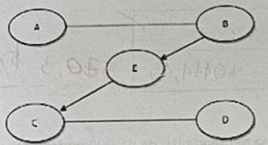
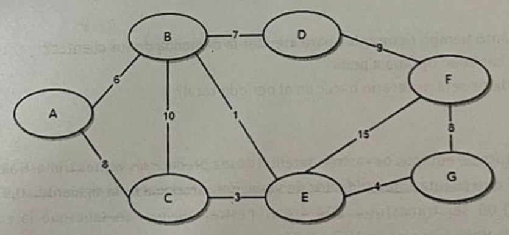

# Segundo parcial de Investigacion Operativa

*Aclaracion: Este escrito es una redaccion de un parcial que me pasaron. Pueden haber errores (confio lo suficiente en mi como para saber que no los habra)   Made with love by GoF*

## Problema 1

Routers S.A. es una empresa que fabrica y vende productos de informatica. La tasa de produccion de los routers es de 500 unidades por mes y tiene una demanda de 3600 unidades anuales. El costo total de pedido optimo es de $80.000,1. Sabiendo que la cantidad optima de pedido es de 90 unidades, calcule:

1. Costo de pedido: *La respuesta correcta debe ser $2.000*
2. Costo de almacenamiento por mes y por unidad de producto: *La respuesta correcta debe ser $370,3 por mes*

## Problema 2

"Conexiones S.A." es una empresa de servicios informaticos que tiene una demanda (N) de 45.000 metros de Cable de Red UTP Cat6 durante 180 dias (T), a una tasa constante de 250 metros por dia. Los cables que utiliza son importados y tienen un costo de $42.500 la bobina de 100 metros. Para almacenar los productos debe considerar las condiciones de temperatura y humedad lo que lleva a un costo de $47,25 por metro y por dia. En esta situacion, la cantidad optima a pedir (q*) es de 404,30 metros, aunque solo vende cuando tiene cable en su almacen. A partir de ahora, no quiere perder la venta cada vez que un cliente llega al negocio y debe esperar para tener la mercaderia, entonces le ofrece un descuento de $425 por dia, con esta nueva politica el stock maximo es de 392,47 (S*). Se pide:

1. ¿Durante cuanto tiempo tiene cable para atender la demanda de sus clientes?
2. ¿Cual sera la cantidad optima a pedir?
3. ¿Cuantos pedidos sera necesario hacer en el periodo total?

## Problema 3

Una empresa productora de equipos de raastre satelital desea predecir las ventas trimestrales para el año 5. La informacion con la que cuenta sobre el factor de variacion estacional es la siguiente: 0,93 1er trimestre, 0,84 2do trimestre, 1,09 3er trimestre, 1,14 4to trimestre. Ademas se sabe que la ecuacion para la componente tendencia tiene la forma T = 15,3 + 0,44t

<table>
  <thead>
    <tr>
      <th>Año</th>
      <th>Periodo</th>
      <th>Ventas (millones)</th>
      <th>Pronostico de tendencia</th>
      <th>Indice estacional</th>
      <th>Pronostico</th>
      <th>Error</th>
    </tr>
  </thead>
  <tbody>
    <tr>
      <td rowspan="4">5</td>
      <td>17</td>
      <td>19,5</td>
      <td>XXX</td>
      <td>0,93</td>
      <td>21,185</td>
      <td>XXX</td>
    </tr>
    <tr>
      <td>18</td>
      <td>21,2</td>
      <td>23,22</td>
      <td>0,84</td>
      <td>19,505</td>
      <td>1,695</td>
    </tr>
    <tr>
      <td>XXX</td>
      <td>26,3</td>
      <td>XXX</td>
      <td>1,09</td>
      <td>25,789</td>
      <td>0,510</td>
    </tr>
    <tr>
      <td>20</td>
      <td>28,4</td>
      <td>24,1</td>
      <td>1,14</td>
      <td>XXX</td>
      <td>0,926</td>
    </tr>
  </tbody>
</table>

Se pide, complete la tabla anterior y responda:

1. ¿Cual es el pronostico de la tendencia para el periodo 17? *La respuesta correcta debe ser 22,78*
2. Determine el pronostico durante el periodo 20 *La respuesta correcta debe ser 27,474*
3. ¿Cual es el error cuadratico medio para los cuatro cuatrimestres calculados? *La respuesta correcta debe ser 1,707*

## Problema 4

1. Dado el siguiente grafo

Seleccione la/las opcion/es correcta/s:

a. No es conexo

b. No hay bucles

c. Hay caminos orientados

d. Hay ciclos

2. La Ciudad de Cordoba esta planificando la construccion de una linea se sistemas de transito que conecte 7 zonas principales de la ciudad, a fines practicos las denominaremos: A, B, C, D, E, F, G. El siguiente grafico muestra las zonas y las posibles relaciones, los numeros sobre las aristas representan la cantidad de kilometros entre las zonas. Cada kilometro de construccion tendra un costo de 4 millones de pesos

Se desea conectar las 7 zonas, pero asegurando no gastar demasiado del presupuesto. Es decir, desea optimizar el costo de construccion de la obra